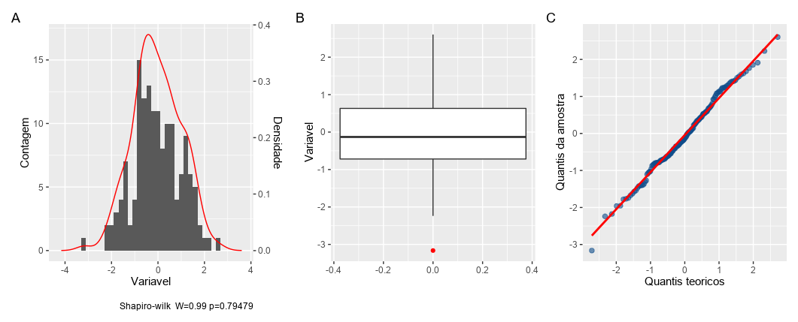

<!-- README.md is generated from README.Rmd. Please edit that file -->

```{r, include = FALSE}
knitr::opts_chunk$set(
  collapse = TRUE,
  comment = "#>",
  fig.path = "man/figures/README-",
  out.width = "100%"
)
```

# catoper

<!-- badges: start -->

<!-- badges: end -->

The `catoper` is a miscellany of functions to facilitate the acquisition, processing, and analysis of public health data, with a special focus on Datasus data.

## Installation

You can install the development version of catoper from [GitHub](https://github.com/) with:

```{r eval=FALSE, message=FALSE, warning=FALSE, include=TRUE}
# install.packages("devtools")
devtools::install_github("denis-or/catoper")
```

## Main Functions

-   `get_event()`: This function is used to read the Tabnet specific health event input form in Datasus. It performs several steps, including input validation, reading metadata, filtering data based on the chosen event. The list of events is standardized and can be found at .

-   `pega_dados()`: This function coordinates several steps to obtain data. It recreates the Tabnet data form, processes arguments and makes a request to obtain the desired data, returning a semi-structured `dataframe`.

## Usage

Main

```{r eval=FALSE, message=FALSE, warning=FALSE, include=TRUE}
library(catoper)

# Example of data retrieval
pagina <- get_event("Imunização Doses Aplicadas")

# Data processing
tabela_D1 <- pega_dados(
 ob = pagina,
 Linha = "Município",
 Coluna = "Dose",
 Medidas = "Doses_aplicadas",
 "Períodos Disponíveis" = 2022,
 "Dose" = "1ª dose",
 "Imunobiológicos" = "Poliomielite inativada (VIP)",
 "Unidade da Federação" = "Rio de Janeiro"
)
```


Other use

```{r eval=FALSE, message=FALSE, warning=FALSE, include=TRUE}
# Normality plots

see_normality(rnorm(100, mean = 0, sd = 1), "Example")
```



## Package reach

```{r eval=TRUE, message=FALSE, warning=FALSE, include=TRUE, echo=FALSE}

main_data <- readRDS("R/sysdata.rda")

main_data |> 
  knitr::kable()

```


## License

This package is available under the MIT License. See the LICENSE file for more details.
